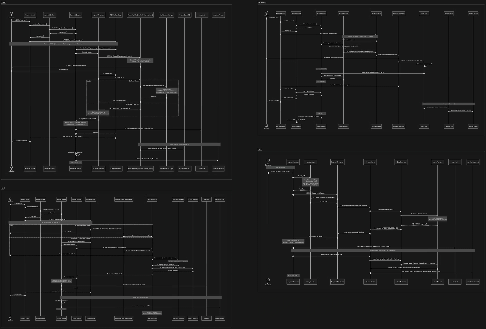
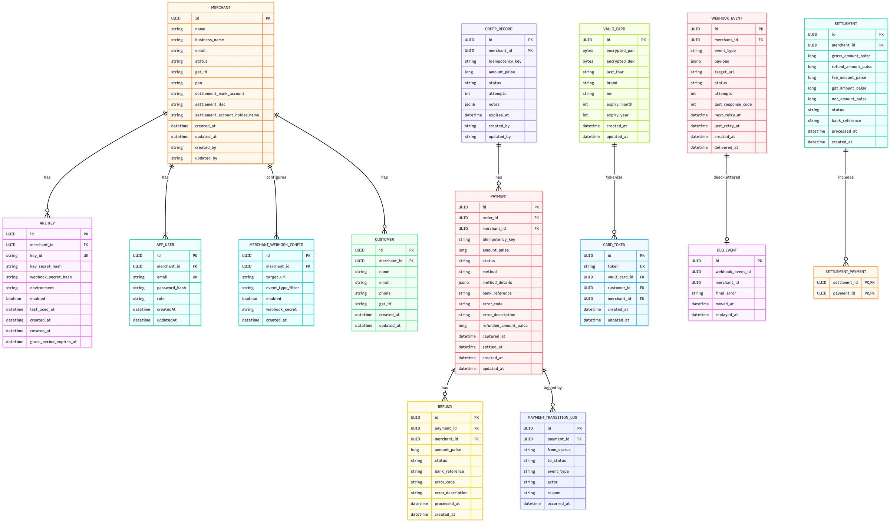

<div align="center">

# 💳 PayFlow — A Razorpay-Style Payment Gateway (Built From Scratch)

**A production-grade payment gateway backend** implementing real payment infrastructure patterns: idempotent APIs, an 8-state payment lifecycle, HMAC-signed webhooks with exponential-backoff retries and dead-lettering, AES-256 card tokenization (vault), and a nightly settlement engine with per-merchant net-fee accounting.

Built to understand — and reproduce — how systems like Razorpay/Stripe actually work under the hood.

[](https://openjdk.org/)
[](https://spring.io/projects/spring-boot)
[](https://www.postgresql.org/)
[](https://redis.io/)
[](https://kafka.apache.org/)
[](LICENSE)
[](PROGRESS.md)

[Live Demo](#) · [API Docs](#) · [Architecture Deep-Dive](ARCHITECTURE.md) · [Progress Log](PROGRESS.md)

</div>

---

## 📅 Weekly Progress

This project is being built and documented in the open, week by week — not dumped as one commit.

👉 **Full week-by-week build log: [PROGRESS.md](PROGRESS.md)**

| Week | Focus | Status |
|---|---|---|
| 1 | Merchant onboarding & API keys | ✅ Done |
| 2 | Order lifecycle | ✅ Done |
| 3 | Payment lifecycle & state machine | ✅ Done |
| 4 | Refunds | 🔧 In progress|
| 5 | Webhook delivery engine (retries + DLQ) | 🔧 In progress |
| 6 | Card vault & tokenization |🔧 In progress |
| 7 | Settlement engine | 🔧 In progress |
| 8 | Multi-tenant security & rate limiting | 🔧 In progress |
| 9 | Analytics dashboard | 🔧 In progress |

See [PROGRESS.md](PROGRESS.md) for the detailed weekly log, and the [commit history](../../commits/main) for the raw build timeline.

---

## 🎯 Why This Project Exists

Most "payment gateway" portfolio projects are a `POST /pay` endpoint that flips a boolean. Real payment gateways are **distributed, stateful, failure-tolerant systems** dealing with money — so I built one that actually behaves like one:

- Payments move through an **enforced state machine**, not a status string you can overwrite.
- Every write is **idempotent** — retried requests never double-charge.
- Webhooks are delivered like a real message queue: **signed, retried with exponential backoff, and dead-lettered** after repeated failures.
- Card numbers are **never stored raw** — they're tokenized through a vault service, like a real PCI-DSS-adjacent design.
- Settlement runs as a **nightly batch job** with fee/GST math and full audit trail, not a live balance update.
- A **chaos-mode mock acquirer** simulates real-world failure (timeouts, declines, slow responses) so the retry/backoff logic is actually exercised, not just happy-path tested.

---

## 🏗️ System Architecture

### High-Level Flow
Customer → Merchant → Payment Gateway → Payment Processor → Acquirer Bank → Card Network / NPCI / Issuer


### Payment Method Flows (Card / UPI / Net Banking / Wallet)
Each payment method has its own sequence diagram covering the full request path, OTP/PIN auth, state transitions, and settlement.



> Full-resolution diagrams: [`/docs/diagrams`](docs/diagrams)

### Entity Relationship Diagram
Core entities: `MERCHANT`, `ORDER_RECORD`, `PAYMENT`, `REFUND`, `PAYMENT_TRANSITION_LOG`, `VAULT_CARD` / `CARD_TOKEN`, `WEBHOOK_EVENT`, `DLQ_EVENT`, `SETTLEMENT`, `SETTLEMENT_PAYMENT`.



### Payment State Machine
```
CREATED → AUTHORIZED → CAPTURED → SETTLED
             │             │
             ▼             ▼
          FAILED      PARTIAL_REFUND → REFUNDED
             │
             ▼
        CANCELLED
```
Every transition is written to `PAYMENT_TRANSITION_LOG` (from_status, to_status, actor, reason, timestamp) — full audit trail, no silent state overwrites.

### Webhook Delivery Pipeline
```
Payment state change
   → Event published (payment.captured / payment.failed / refund.processed)
   → Kafka consumer picks up event
   → Load merchant webhook config
   → HMAC-SHA256 sign payload
   → Enqueue into Redis Sorted Set (scheduled delivery)
   → Delivery service polls due deliveries every 5s
   → HTTP POST to merchant endpoint
        ├─ 2XX → mark DELIVERED
        └─ failure → retry count < 7 → exponential backoff (1m, 5m, 30m, 2h, 8h, 24h)
                     retry count ≥ 7 → move to Dead Letter Queue (replayable via API)
```

---

## ⚙️ Core Features

| Domain | What's implemented |
|---|---|
| **Merchant Onboarding** | KYC signup (business name, GST ID), bcrypt-hashed login, API key generation with show-once secret, key rotation with grace period |
| **Orders** | Create/list/filter/paginate, 15-minute auto-expiry, idempotent creation via `X-Idempotency-Key` |
| **Payments** | Card / UPI / Net Banking / Wallet support, mock acquirer with chaos modes (`SUCCESS`, `FAILURE`, `TIMEOUT`, `SLOW`), 8-state FSM with enforced transitions |
| **Refunds** | Full and partial refunds, async processing via scheduled job, sub-state machine (`PENDING → PROCESSING → PROCESSED/FAILED`) |
| **Card Vault** | Browser-to-vault direct tokenization (never touches merchant server), AES-256 PAN encryption, charge-with-token flow, no get-PAN API exists by design |
| **Webhooks** | Per-merchant configurable URLs, HMAC-SHA256 signed payloads, 7-attempt exponential backoff, Dead Letter Queue, replay API |
| **Settlement** | Nightly batch job, 2% fee + 18% GST calculation, per-merchant net settlement, full audit trail, mock bank transfer with simulated chaos |
| **Multi-Tenant Security** | API key auth (server-to-server), JWT auth (dashboard), per-merchant rate limiting (token bucket / sliding window / fixed window) |
| **Analytics** | Real-time revenue dashboard, per-merchant filters, 30-day historical reports |

---

## 🧠 Key Engineering Decisions

*(Full write-ups in [ARCHITECTURE.md](ARCHITECTURE.md))*

1. **Why a strict payment state machine instead of a status column?** Prevents race conditions where two concurrent webhooks/callbacks could move a payment backward (e.g. `CAPTURED → AUTHORIZED`). Transitions are validated against an allow-list before commit.
2. **Why Redis Sorted Sets for webhook scheduling instead of cron?** Sub-second scheduling precision for retry backoff, O(log N) insert, and natural "due now" queries via `ZRANGEBYSCORE` — a cron sweep every minute can't give you a 1-minute-later retry cleanly.
3. **Why tokenize on the browser→vault path instead of merchant→vault?** Keeps raw PAN out of the merchant server entirely, closer to real PCI-DSS scope reduction.
4. **Why idempotency keys on both orders and payments?** Network retries are the norm, not the exception, in payment flows — a duplicate `POST` must never create a duplicate charge.
5. **Why a mock acquirer with chaos modes?** Payment gateways are defined by how they handle failure. Chaos modes force the retry/backoff/DLQ code paths to actually run in dev/test, not just the happy path.

---

## 🛠️ Tech Stack

| Layer | Technology |
|---|---|
| Backend | Java 25, Spring Boot 4 |
| Database | PostgreSQL  |
| Cache / Scheduling | Redis (Sorted Sets for webhook delivery scheduling) |
| Event Bus | Kafka (payment state change events) |
| Auth | JWT (dashboard), API Key + HMAC (server-to-server) |
| Encryption | AES-256 (card vault) |
| Containerization | Docker, Docker Compose |
| Testing | JUnit 5, Testcontainers |

---

## 🚀 Getting Started

```bash
git clone https://github.com/<your-username>/payflow.git
cd payflow
docker-compose up --build
```

Services will be available at:
- API: `http://localhost:8080`
- Dashboard: `http://localhost:3000`


### Environment Variables
See [`.env.example`](.env.example) for required config (DB, Redis, Kafka, encryption keys).

---

## 📖 API Documentation

Full API reference: [`/docs/api`](docs/api) (OpenAPI/Swagger UI at `http://localhost:8080/swagger-ui.html` once running)

Example — create an order:
```bash
curl -X POST http://localhost:8080/v1/orders \
  -H "Authorization: Basic <api_key>:<api_secret>" \
  -H "X-Idempotency-Key: <uuid>" \
  -H "Content-Type: application/json" \
  -d '{"amount": 50000, "currency": "INR", "receipt": "order_rcpt_1"}'
```

---

## 🗺️ Roadmap / Progress

Full week-by-week build log: **[PROGRESS.md](PROGRESS.md)**

- [x] Merchant onboarding & API key auth
- [x] Order lifecycle
- [x] Payment lifecycle + state machine
- [x] Mock acquirer with chaos modes
- [x] Refund lifecycle
- [x] Webhook delivery with backoff + DLQ
- [x] Card vault & tokenization
- [x] Settlement engine
- [ ] Analytics dashboard (in progress)
- [ ] Rate limiting per merchant (in progress)
- [ ] Load testing report

---

## 📄 License

MIT — see [LICENSE](LICENSE)

---

<div align="center">
<sub>Built solo as a systems-design deep dive into how payment gateways work. Not affiliated with Razorpay.</sub>
</div>
